```python
import matplotlib.pyplot as plt
import numpy as np
import pandas as pd
import seaborn as sns
import matplotlib as mpl
```


```python
total_accidents = pd.read_csv('total_accidents.csv', index_col="year", parse_dates=True)
total_accidents.head()
```


<div>
<style scoped>
    .dataframe tbody tr th:only-of-type {
        vertical-align: middle;
    }

    .dataframe tbody tr th {
        vertical-align: top;
    }

    .dataframe thead th {
        text-align: right;
    }
</style>
<table border="1" class="dataframe">
  <thead>
    <tr style="text-align: right;">
      <th></th>
      <th>total_accidents</th>
      <th>fatal</th>
      <th>non_fatal</th>
      <th>people_killed</th>
      <th>people_injured</th>
      <th>total_vehicles</th>
    </tr>
    <tr>
      <th>year</th>
      <th></th>
      <th></th>
      <th></th>
      <th></th>
      <th></th>
      <th></th>
    </tr>
  </thead>
  <tbody>
    <tr>
      <th>2009-10</th>
      <td>9747</td>
      <td>4378</td>
      <td>5369</td>
      <td>5280</td>
      <td>11173</td>
      <td>10496</td>
    </tr>
    <tr>
      <th>2010-11</th>
      <td>9723</td>
      <td>4280</td>
      <td>5443</td>
      <td>5271</td>
      <td>11383</td>
      <td>10822</td>
    </tr>
    <tr>
      <th>2011-12</th>
      <td>9140</td>
      <td>3966</td>
      <td>5174</td>
      <td>4758</td>
      <td>10145</td>
      <td>9986</td>
    </tr>
    <tr>
      <th>2012-13</th>
      <td>8988</td>
      <td>3884</td>
      <td>5104</td>
      <td>4719</td>
      <td>9710</td>
      <td>9876</td>
    </tr>
    <tr>
      <th>2013-14</th>
      <td>8359</td>
      <td>3500</td>
      <td>4859</td>
      <td>4348</td>
      <td>9777</td>
      <td>9423</td>
    </tr>
  </tbody>
</table>
</div>


```python
provincial_accidents = pd.read_csv('provincial_accidents.csv', index_col="year", parse_dates=True)
provincial_accidents.head()
```


<div>
<style scoped>
    .dataframe tbody tr th:only-of-type {
        vertical-align: middle;
    }

    .dataframe tbody tr th {
        vertical-align: top;
    }

    .dataframe thead th {
        text-align: right;
    }
</style>
<table border="1" class="dataframe">
  <thead>
    <tr style="text-align: right;">
      <th></th>
      <th>total_accidents</th>
      <th>fatal</th>
      <th>non_fatal</th>
      <th>people_killed</th>
      <th>people_injured</th>
      <th>total_vehicles</th>
      <th>province</th>
    </tr>
    <tr>
      <th>year</th>
      <th></th>
      <th></th>
      <th></th>
      <th></th>
      <th></th>
      <th></th>
      <th></th>
    </tr>
  </thead>
  <tbody>
    <tr>
      <th>2009-10</th>
      <td>5344</td>
      <td>2590</td>
      <td>2754</td>
      <td>3083</td>
      <td>5856</td>
      <td>5344</td>
      <td>Punjab</td>
    </tr>
    <tr>
      <th>2010-11</th>
      <td>5420</td>
      <td>2591</td>
      <td>2829</td>
      <td>3167</td>
      <td>5809</td>
      <td>5420</td>
      <td>Punjab</td>
    </tr>
    <tr>
      <th>2011-12</th>
      <td>4990</td>
      <td>2361</td>
      <td>2629</td>
      <td>2888</td>
      <td>5071</td>
      <td>4990</td>
      <td>Punjab</td>
    </tr>
    <tr>
      <th>2012-13</th>
      <td>4587</td>
      <td>2213</td>
      <td>2374</td>
      <td>2692</td>
      <td>4515</td>
      <td>4587</td>
      <td>Punjab</td>
    </tr>
    <tr>
      <th>2013-14</th>
      <td>3696</td>
      <td>1717</td>
      <td>1979</td>
      <td>2145</td>
      <td>3941</td>
      <td>3696</td>
      <td>Punjab</td>
    </tr>
  </tbody>
</table>
</div>


```python
provincial_accidents.tail()
```


<div>
<style scoped>
    .dataframe tbody tr th:only-of-type {
        vertical-align: middle;
    }

    .dataframe tbody tr th {
        vertical-align: top;
    }

    .dataframe thead th {
        text-align: right;
    }
</style>
<table border="1" class="dataframe">
  <thead>
    <tr style="text-align: right;">
      <th></th>
      <th>total_accidents</th>
      <th>fatal</th>
      <th>non_fatal</th>
      <th>people_killed</th>
      <th>people_injured</th>
      <th>total_vehicles</th>
      <th>province</th>
    </tr>
    <tr>
      <th>year</th>
      <th></th>
      <th></th>
      <th></th>
      <th></th>
      <th></th>
      <th></th>
      <th></th>
    </tr>
  </thead>
  <tbody>
    <tr>
      <th>2015-16</th>
      <td>244</td>
      <td>120</td>
      <td>124</td>
      <td>140</td>
      <td>209</td>
      <td>244</td>
      <td>Islamabad</td>
    </tr>
    <tr>
      <th>2016-17</th>
      <td>226</td>
      <td>127</td>
      <td>99</td>
      <td>129</td>
      <td>124</td>
      <td>216</td>
      <td>Islamabad</td>
    </tr>
    <tr>
      <th>2017-18</th>
      <td>259</td>
      <td>157</td>
      <td>102</td>
      <td>167</td>
      <td>162</td>
      <td>259</td>
      <td>Islamabad</td>
    </tr>
    <tr>
      <th>2018-19</th>
      <td>238</td>
      <td>127</td>
      <td>111</td>
      <td>136</td>
      <td>134</td>
      <td>239</td>
      <td>Islamabad</td>
    </tr>
    <tr>
      <th>2019-20</th>
      <td>189</td>
      <td>111</td>
      <td>78</td>
      <td>118</td>
      <td>121</td>
      <td>189</td>
      <td>Islamabad</td>
    </tr>
  </tbody>
</table>
</div>


```python
all_accidents = pd.read_csv('all_accidents.csv')
total_accidents = pd.read_csv('total_accidents.csv')
provincial_accidents = pd.read_csv('provincial_accidents.csv')
```


```python
plt.figure(figsize=(20,7))
plt.style.use('seaborn-darkgrid')
sns.lineplot(x='year', y='total_accidents', hue='province',  data=provincial_accidents) #style='region'
```


    <AxesSubplot:xlabel='year', ylabel='total_accidents'>


```python
plt.figure(figsize=(15, 7))
sns.barplot(x='year', y='total_accidents', data=total_accidents)
plt.show()
```


    
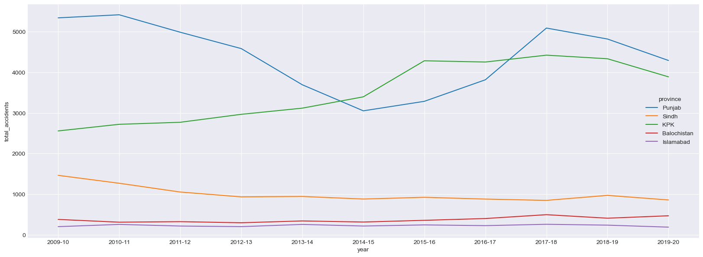
    


    
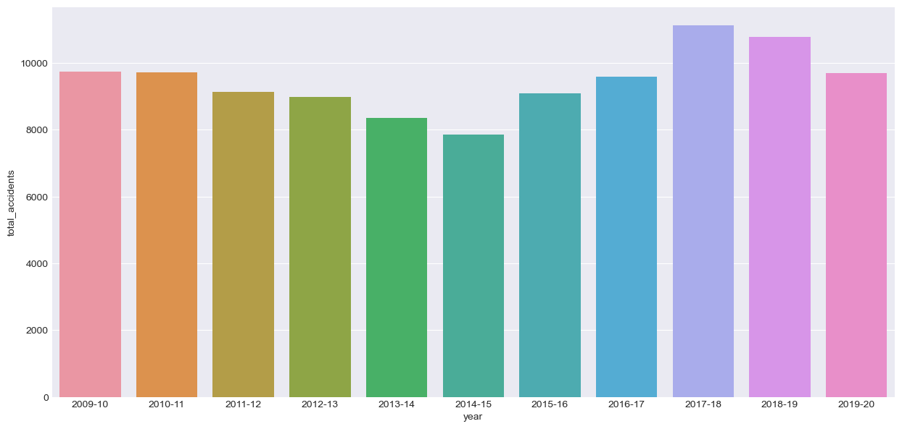
    


```python
plt.figure(figsize=(15,7))
sns.barplot(x='year', y='total_accidents', hue=provincial_accidents.province, data=provincial_accidents)
plt.show()
```


    
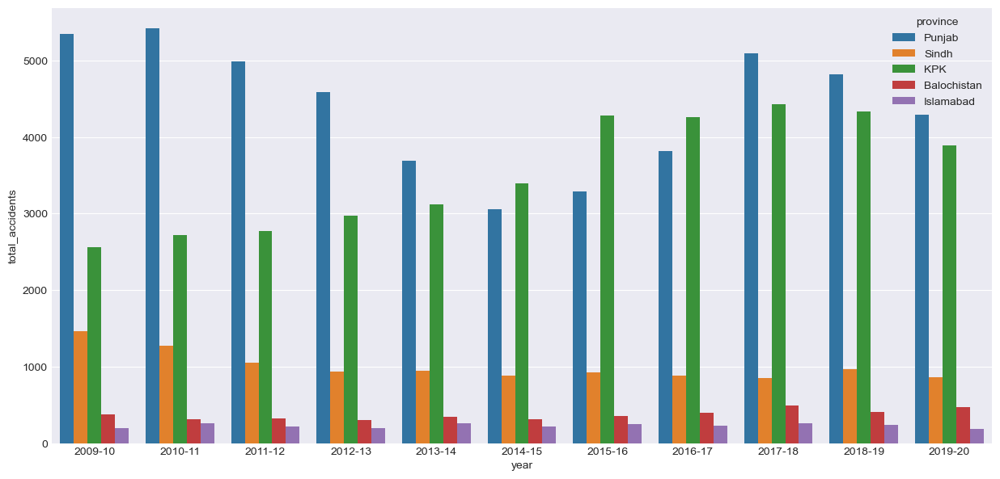
    


```python
sns.catplot(x='year', y='total_accidents', data=provincial_accidents, col='province')
```


    <seaborn.axisgrid.FacetGrid at 0x1546d42eb80>


```python
total_accidents.hist(bins=20, figsize=(20,20))
plt.show()
```


    
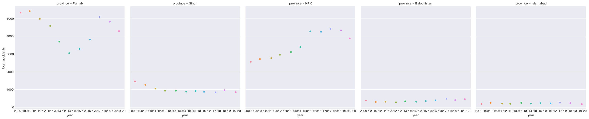
    


    
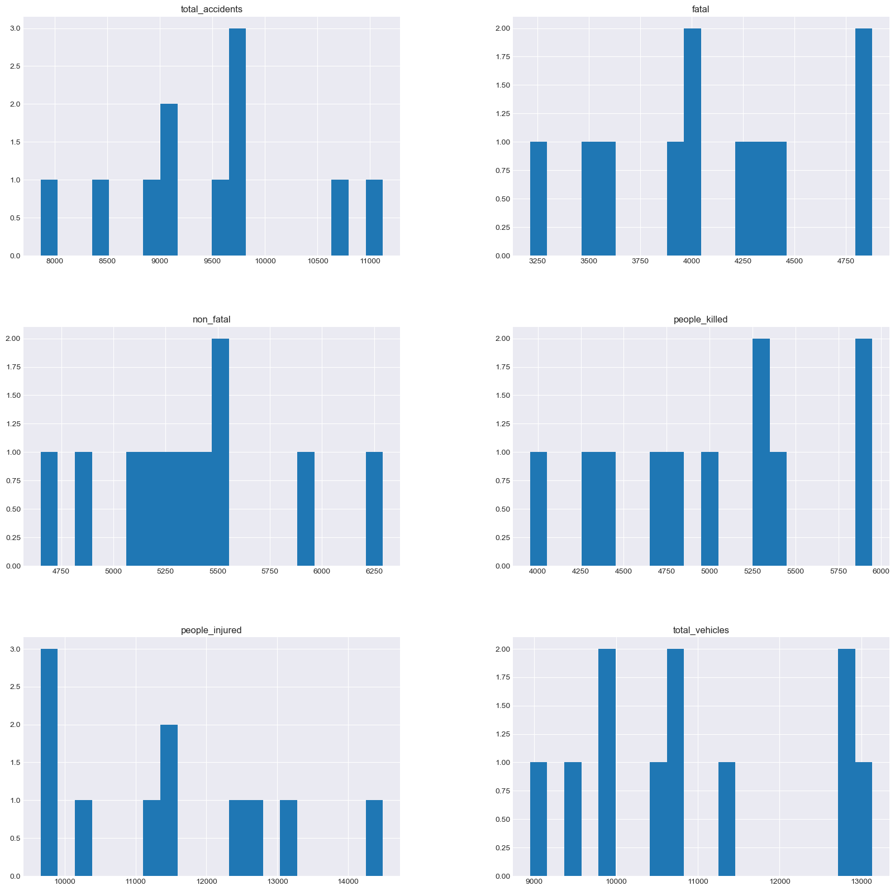
    


```python
plt.figure(figsize=(15,7))
sns.distplot(total_accidents['total_accidents'], bins=5)
plt.show()
```

    C:\Users\zubai\anaconda3\lib\site-packages\seaborn\distributions.py:2557: FutureWarning: `distplot` is a deprecated function and will be removed in a future version. Please adapt your code to use either `displot` (a figure-level function with similar flexibility) or `histplot` (an axes-level function for histograms).
      warnings.warn(msg, FutureWarning)


    
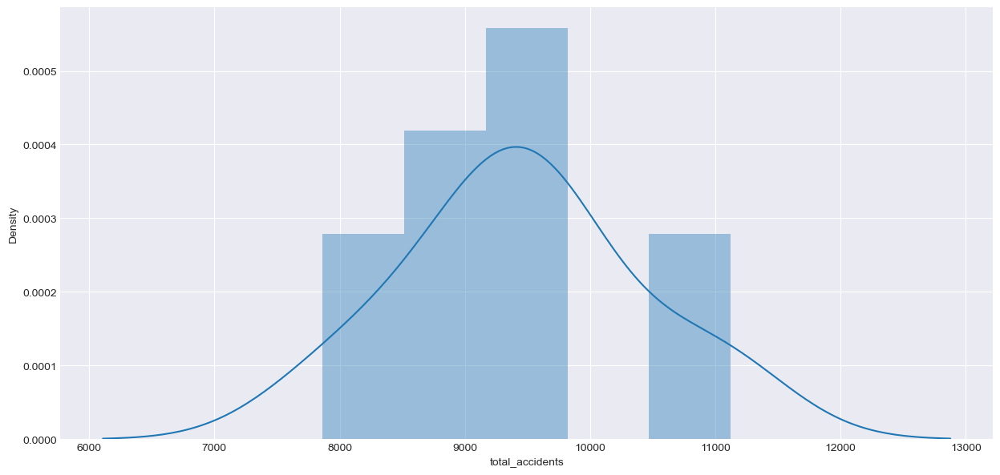
    


```python
plt.figure(figsize=(15,7))
sns.barplot(x=provincial_accidents.year, y=provincial_accidents.total_accidents, hue=provincial_accidents.province)
sns.despine()
plt.show()
```


    

    


```python
plt.figure(figsize=(15,7))
sns.barplot(x=provincial_accidents.year, y=provincial_accidents.fatal, hue=provincial_accidents.province)
sns.despine()
plt.show()
```


    
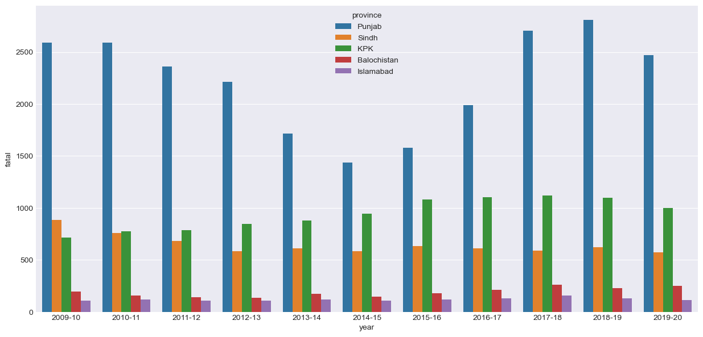
    


```python
plt.figure(figsize=(15,7))
sns.barplot(x=provincial_accidents.year, y=provincial_accidents.non_fatal, hue=provincial_accidents.province)
sns.despine()
plt.show()
```


    
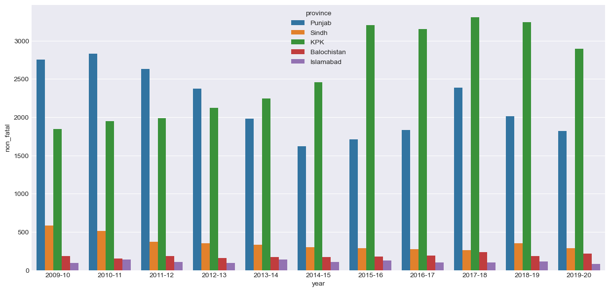
    


```python
plt.figure(figsize=(15,7))
sns.barplot(x=provincial_accidents.year, y=provincial_accidents.people_killed, hue=provincial_accidents.province)
sns.despine()
plt.show()
```


    
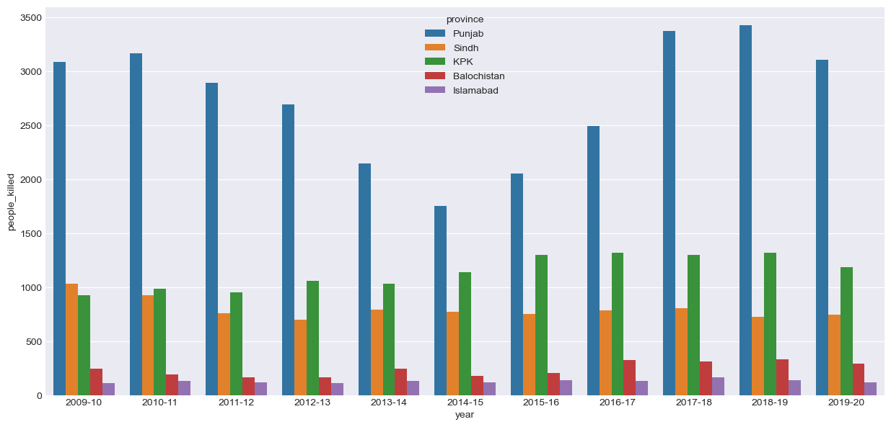
    


```python
plt.figure(figsize=(15,7))
sns.barplot(x=provincial_accidents.year, y=provincial_accidents.people_injured, hue=provincial_accidents.province)
sns.despine()
plt.show()
```


    
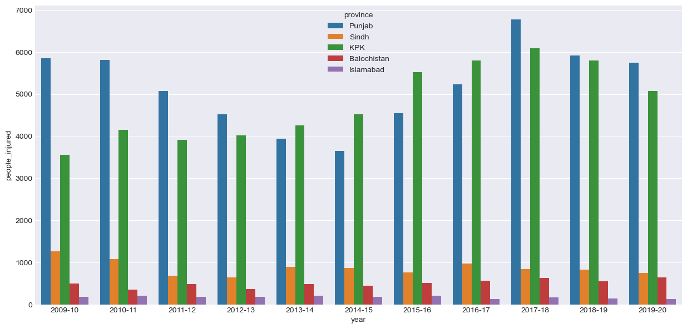
    


```python
plt.figure(figsize=(15,7))
sns.barplot(x=provincial_accidents.year, y=provincial_accidents.total_vehicles, hue=provincial_accidents.province)
sns.despine()
plt.show()
```


    
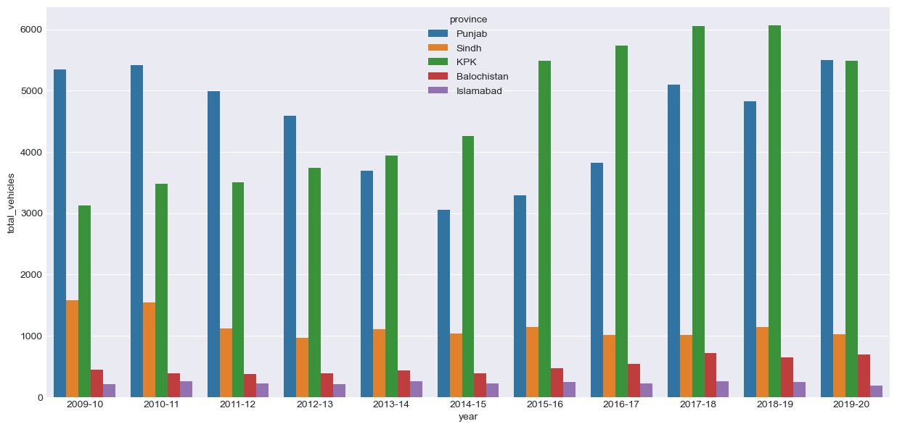
    


```python
plt.figure(figsize=(15,7))
sns.barplot(x=provincial_accidents.province, y=provincial_accidents.total_accidents, hue=provincial_accidents.province)
sns.despine()
plt.show()
```


    
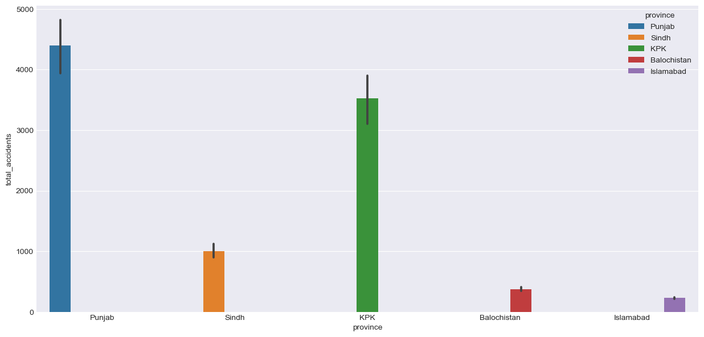
    


```python
plt.figure(figsize=(15,7))
sns.barplot(x=provincial_accidents.province, y=provincial_accidents.fatal, hue=provincial_accidents.province)
sns.despine()
plt.show()
```


    
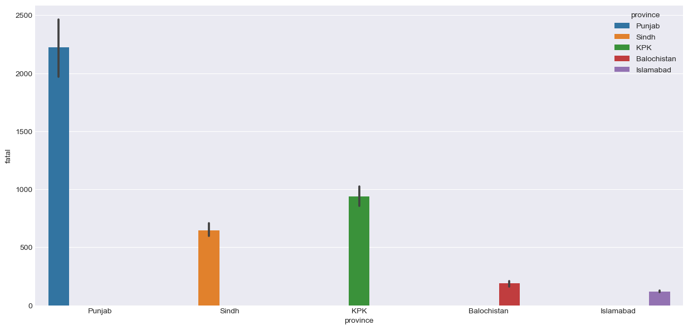
    


```python
plt.figure(figsize=(15,7))
sns.barplot(x=provincial_accidents.province, y=provincial_accidents.non_fatal, hue=provincial_accidents.province)
sns.despine()
plt.show()
```


    
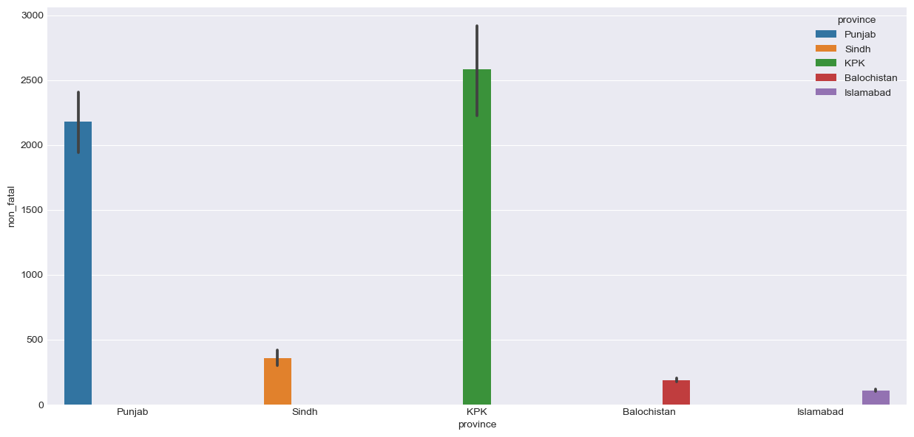
    


```python
plt.figure(figsize=(15,7))
sns.barplot(x=provincial_accidents.province, y=provincial_accidents.people_killed, hue=provincial_accidents.province)
sns.despine()
plt.show()
```


    
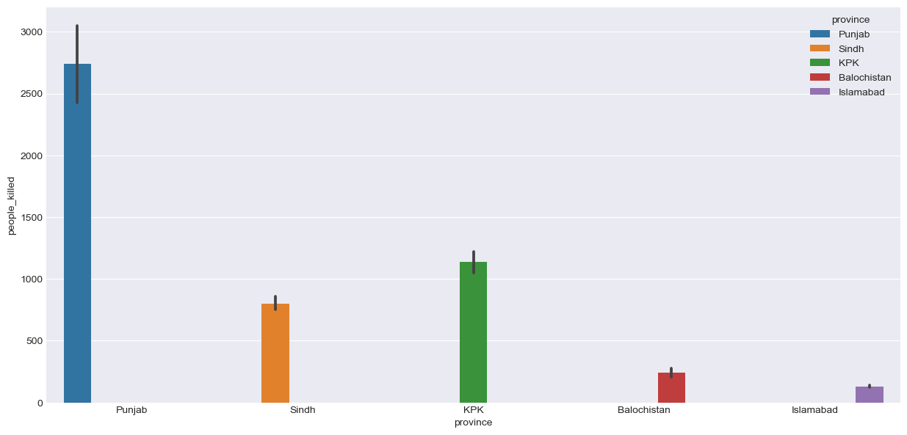
    


```python
plt.figure(figsize=(15,7))
sns.barplot(x=provincial_accidents.province, y=provincial_accidents.people_injured, hue=provincial_accidents.province)
sns.despine()
plt.show()
```


    
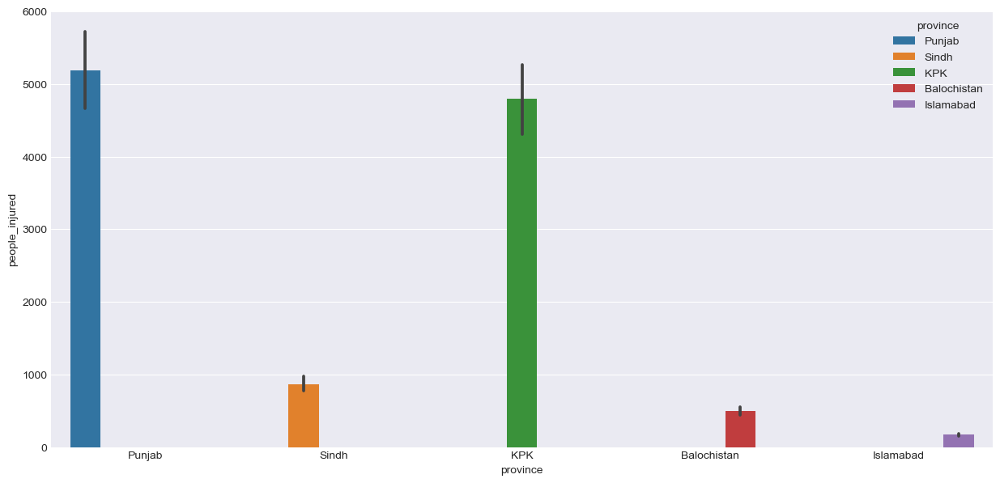
    


```python
plt.figure(figsize=(15,7))
sns.barplot(x=provincial_accidents.province, y=provincial_accidents.total_vehicles, hue=provincial_accidents.province)
sns.despine()
plt.show()
```


    
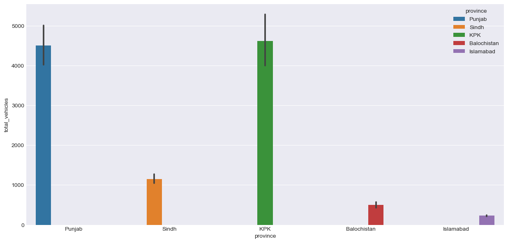
    


```python
plt.figure(figsize=(20, 10))
sns.catplot('total_accidents', col='province', col_wrap=5, data=provincial_accidents, kind='count', height=5, aspect=1)
plt.show()
```

    C:\Users\zubai\anaconda3\lib\site-packages\seaborn\_decorators.py:36: FutureWarning: Pass the following variable as a keyword arg: x. From version 0.12, the only valid positional argument will be `data`, and passing other arguments without an explicit keyword will result in an error or misinterpretation.
      warnings.warn(


    <Figure size 2000x1000 with 0 Axes>


    
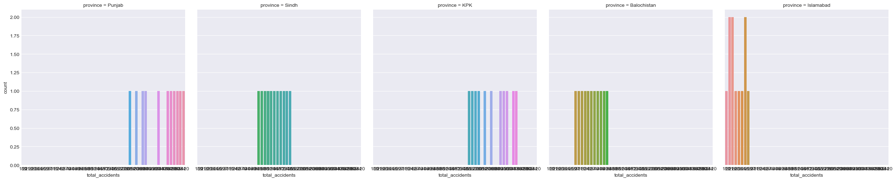
    


```python

```
